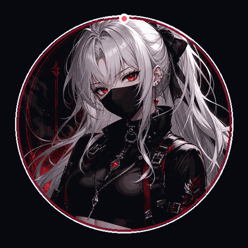

  

<h1 align="center">Toliya-max</h1>

  Nezeronxer · Practical systems builder based in Russia.

  
  
  
  
  
  

---

## About Me

I go by **Nezeronxer** online and build practical systems for networking, automation, desktop tools, and security-minded workflows.

- Based in **Russia**.
- Discord: **nezeronxer**.
- YouTube: [@nezeron666](https://www.youtube.com/@nezeron666).
- I like tools that feel calm to use, but stay reliable when the real world gets messy.

## What I Build

I work on tools that sit close to real operations: network infrastructure, Telegram automation, Windows desktop utilities, local AI workflows, and security-focused repair work.

My favorite kind of project is calm on the surface and stubborn under load: clear controls, practical diagnostics, small blast radius, and proof that the thing actually works.

## Current Focus

| Area | What it means |
| --- | --- |
| Networking tools | VPN-oriented utilities, routing UX, subscription handling, health checks, and admin surfaces. |
| Telegram automation | Bots, owner panels, key/proxy workflows, content pipelines, and low-friction controls. |
| Desktop utilities | Windows-first apps, hotkeys, overlays, packaged builds, and local workflow automation. |
| Knowledge workflows | Graph-backed project memory, documentation habits, and context that survives across sessions. |
| Security repair | Threat modeling, practical hardening, safer defaults, and verification after fixes. |

## Selected Work

| Project direction | Short version |
| --- | --- |
| **ZapretKVN-style desktop networking** | Windows client work around protocol subscriptions, health checks, runtime safety, and user-facing controls. |
| **VPN key and proxy automation** | Telegram-first workflows for delivering and managing access with cleaner owner controls. |
| **VoxFlow-style desktop dictation** | Local speech-to-text workflow with desktop UX, hotkeys, packaged launch, and recognition diagnostics. |
| **Lichess tooling and site work** | Product polish, checkout/security boundaries, installer trust, and distribution workflow repair. |
| **Graphify knowledge base** | Project memory and graph-based context lookup for long-running technical work. |

## Toolbox

  
  
  
  
  
  
  
  
  
  

## Principles

- Prefer tools that are simple to operate and easy to verify.
- Keep risky changes narrow, staged, and reversible.
- Make admin workflows button-driven when possible.
- Treat documentation as part of the system, not an afterthought.
- Ship fixes with evidence, not just good intentions.

## GitHub Stats

  
  

## Contact

The best place to reach me is through GitHub or Discord.

- GitHub: [Toliya-max](https://github.com/Toliya-max)
- Discord: **nezeronxer**
- YouTube: [@nezeron666](https://www.youtube.com/@nezeron666)
